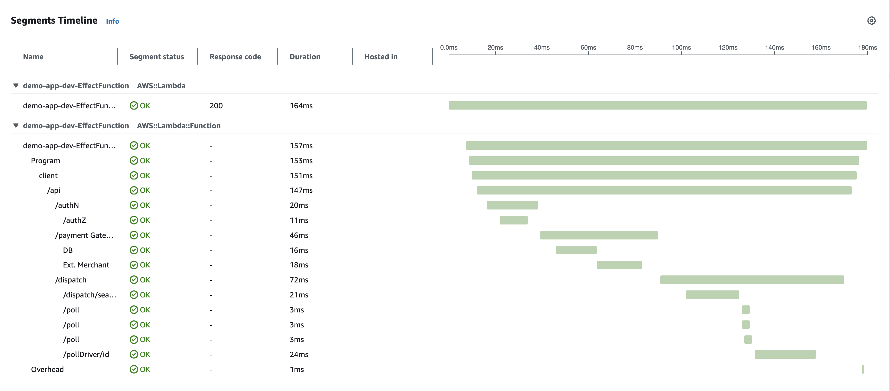
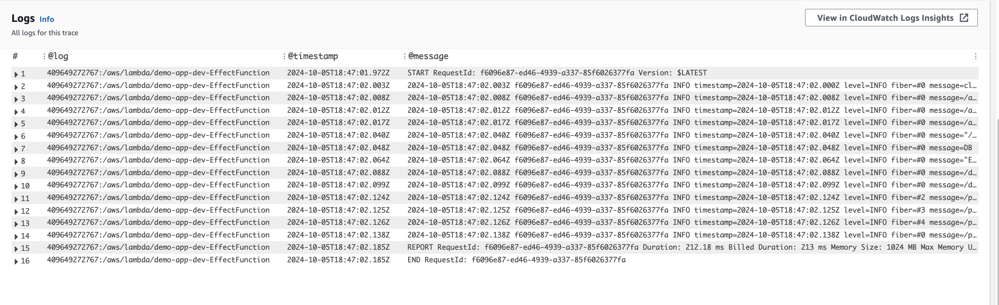

# Effect X-Ray

AWS X-Ray Powertools SDK for [Effect](https://effect.website/). This experimental library allows you to trace your Effect programs and send them to AWS X-Ray leveraging the [Powertools SDK](https://docs.powertools.aws.dev/lambda/typescript/latest/core/tracer/).

Install (NodeJS):

```bash
npx jsr add @sellooh/effect-xray
```

```typescript
const program = Effect.gen(function* () {
  yield* Effect.log("Hello");
  yield* Effect.annotateCurrentSpan({ message: "Metadata" });
}).pipe(
  Effect.withSpan("MyTrace"),
)

const programLive = program.pipe(
  Effect.provide(XraySdk.layer())
);
Effect.runPromise(programLive);
```

Check out the a more complete example in the [demo-app](https://github.com/sellooh/effect-xray/blob/main/demo-app/functions/lambda.ts).

Traces:




Logs:


